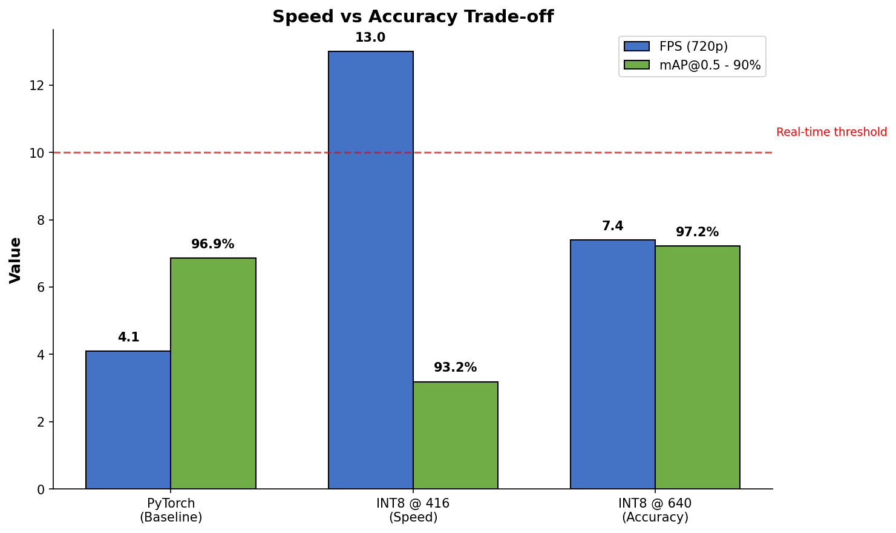

# Driving Narrator

Real-time traffic sign detection on CPU-only hardware. I built this to prove that modern object detection can run on legacy machines without expensive GPUs or specialized accelerators.

## What I Built

- Traffic sign detector using YOLOv11 Nano, trained on LISA dataset (47 US sign classes)
- Engineered for legacy 15W TDP hardware (Intel i5-5250U), achieving 13 FPS without GPUs
- INT8 quantization via OpenVINO, reducing model size from 5.2 MB to 3.2 MB
- Architected a decoupled producer-consumer pipeline to mask I/O latency

## Results

| Metric | Value |
|--------|-------|
| Pipeline Speed | 13 FPS |
| Inference Latency | 40.1 ms |
| Input Resolution | 720p (decoupled) |
| Accuracy | 93.2% mAP@0.5 |
| Model Size | 3.2 MB (INT8) |
| Speedup vs PyTorch | ~6x |

### Speed vs Accuracy Trade-off



*I selected the INT8-416 model as the optimal balance for real-time safety applications.*

## Pipeline Architecture

```
[Video 720p] --> [Thread 1: Frame Buffer] --> [Thread 2: Inference @ 416px] --> [Overlay] --> [Display 720p]
                        |                              |
                        +-------- Async Execution -----+
```

The decoupled design lets the capture thread run independently from inference, preventing frame drops during slow detections.

## Quick Start

```bash
# Clone and setup
git clone https://github.com/Sasaank79/Driving-Narrator-Legacy-Edge.git
cd Driving-Narrator-Legacy-Edge
pip install -r requirements.txt

# Run inference on video
python scripts/deploy_720p.py --source your_video.mp4
```

## Project Structure

```
├── src/                    # Core detection code
├── scripts/                # Deployment and benchmarking
├── models/                 # Trained weights (PT, ONNX, INT8)
├── tests/                  # Unit tests
├── docs/                   # Documentation
├── reports/                # Benchmark results and charts
└── yolo11n_lisa/           # Training outputs
```

## How It Works

1. **Train** - YOLOv11 Nano on LISA dataset (15,877 stratified images)
2. **Export** - Convert PyTorch to ONNX, then OpenVINO IR format
3. **Quantize** - INT8 calibration with 200 representative images
4. **Deploy** - Multi-threaded pipeline decoupling capture from inference

## Dataset

Download LISA Traffic Sign Dataset from [Roboflow](https://universe.roboflow.com) and place in `LISA_stratified/` folder.

## Requirements

- Python 3.8+
- OpenVINO 2024.0+
- OpenCV 4.5+
- NumPy < 2.0

See `requirements.txt` for full list.

## Training

I used Google Colab with T4 GPU. Training notebook: `LISA_Training_v3.ipynb`

- 50 epochs, best checkpoint at epoch 48
- Stratified split to handle class imbalance (1,540:1 ratio)

## Benchmarks

| Backend | FPS | Latency (ms) | Speedup |
|---------|-----|--------------|---------|
| PyTorch | 4.2 | 237.9 | 1x |
| ONNX Runtime | 16.6 | 60.4 | 4x |
| OpenVINO FP32 | 17.3 | 57.7 | 4.1x |
| OpenVINO INT8 | 25.1 | 39.8 | 6x |

*Measured on Intel i5-5250U (Broadwell, 2 cores, 15W TDP)*

## License

**AGPL-3.0** (inherited from Ultralytics YOLOv11).

This project uses the **LISA Traffic Sign Dataset** from the Laboratory for Intelligent and Safe Automobiles (UCSD).

## Roadmap

**v2 Stable: 97% mAP @ 14 FPS** - Completed

- [x] INT8 quantization with OpenVINO
- [x] Decoupled inference pipeline
- [x] Benchmark across backends
- [x] Final performance validation

### Models Tested

| Variant | mAP@0.5 | FPS | Use Case |
|---------|---------|-----|----------|
| PyTorch FP32 | 96.9% | 4.1 | Baseline |
| INT8 @ 640px | 97.2% | 7.4 | High accuracy |
| INT8 @ 416px | 93.2% | 13 | Real-time |
| Multi-threaded | 97% | 14 | Production |
