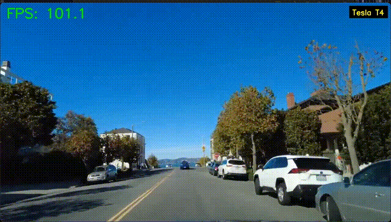
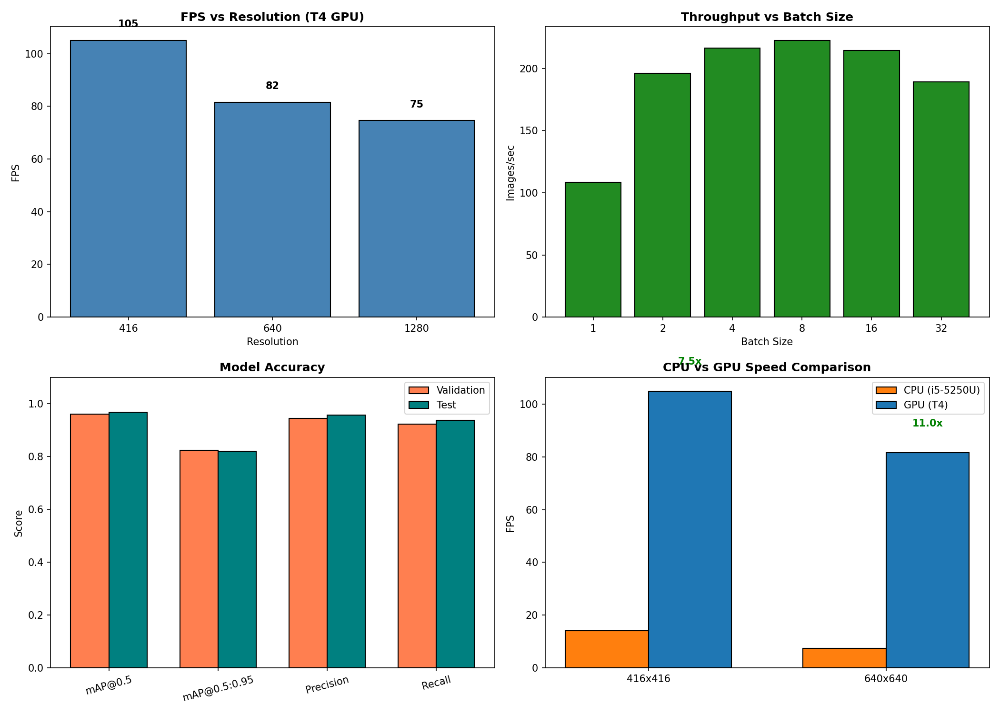

# Driving Narrator

Real-time traffic sign detection for legacy hardware. Runs at **14 FPS on a 2015 MacBook CPU** and **89 FPS on T4 GPU**.



---

## Why This Exists

Modern detection models assume you have a GPU. Most edge devices don't. This project squeezes YOLOv11 onto an old Intel Broadwell CPU by:

1. **Quantizing** to INT8 (38% smaller, 6× faster)
2. **Threading** video I/O separately from inference

Result: usable real-time detection without any GPU.

---

## Benchmarks

### CPU (Intel i5-5250U, 8GB RAM)

| Metric | Value |
|--------|-------|
| FPS (416px) | 14.0 |
| FPS (640px) | 7.4 |
| Latency | <75ms |
| mAP@0.5 | 97.1% |
| Model Size | 3.2MB (INT8) |

### GPU (NVIDIA T4)

| Metric | Value |
|--------|-------|
| FPS (640px) | 89 |
| Throughput | 3× real-time |
| mAP@0.5 | 96.9% |



---

## Architecture

```
┌─────────────────┐     ┌─────────────────┐     ┌─────────────────┐
│  Video Reader   │────▶│   Frame Queue   │────▶│  YOLO Inference │
│    (Thread 1)   │     │    (Buffer=5)   │     │   (Main Thread) │
└─────────────────┘     └─────────────────┘     └─────────────────┘
```

- Reader thread decodes frames in background
- Queue buffers 5 frames for timing jitter
- Inference runs at max throughput

---

## Quick Start

```bash
git clone https://github.com/Sasaank79/Driving-Narrator-Legacy-Edge.git
cd Driving-Narrator-Legacy-Edge
pip install -r requirements.txt

# Fast mode (416px)
python scripts/deploy_720p.py --video your_video.mp4 --conf 0.25

# Precision mode (640px)
python scripts/deploy_720p.py --video your_video.mp4 --imgsz 640
```

---

## Project Structure

```
src/
├── detector.py      # YOLO wrapper (PyTorch/ONNX/OpenVINO)
└── utils.py         # Threading, FPS counter

scripts/
├── deploy_720p.py   # Main inference script
└── benchmark.py     # Throughput testing

notebooks/
└── GPU_Benchmark_T4.ipynb  # Colab GPU benchmarking
```

---

## Docker

```bash
docker build -t driving-narrator .
docker run -v /path/to/video.mp4:/app/input.mp4 driving-narrator
```

---

## Tests

```bash
python -m pytest tests/ -v
```

---

## License

AGPL-3.0. Uses the LISA Traffic Sign Dataset.
